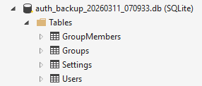
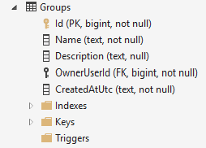
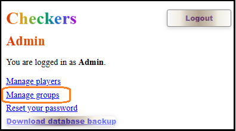
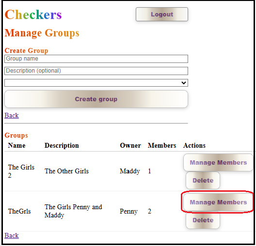
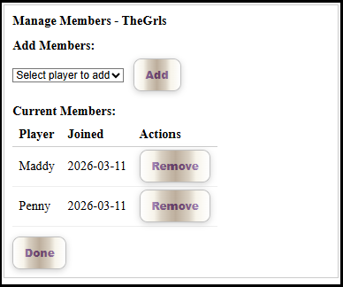
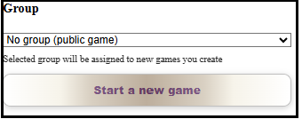
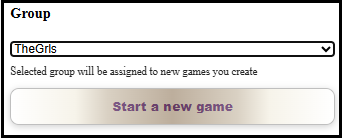
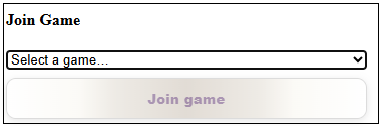
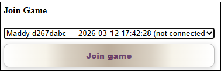
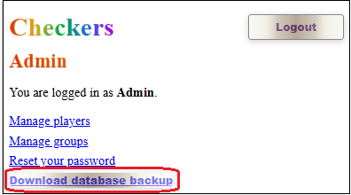

# Groups Feature Implementation

## Overview
Complete implementation of a Groups feature for the Draughts application, allowing administrators to create groups, assign players, and restrict game visibility based on group membership.

The database is a SQLite database file.

- A Group has a name, optional description, an player who is an owner and a player who joins
- A Game has one Group
- A Group has a Group Owner
- When they have connected, a Group has a joined player.
- Currently Groups are created by the admin and players are added to groups by the Admin. 
- Players can be in multiple groups. 
- When a player creates a game, they can select one of their groups to associate the game with. 
- Games are associated with a group and are only visible to members of that group to join.
- _It is envisged that in the future players will be able to create their own groups and manage their membership, but for now this is an admin-only feature._

  
<b><i><small>Database tables</small></i></b>

  
<b><i><small>Database Group Table</small></i></b>
## Phase 1: Database Schema and Admin UI

### 1.1 Database Entities
**File:** `Data/Group.cs`
- Created `Group` entity with Id, Name, OwnerUserId, CreatedUtc
- Created `GroupMember` entity with GroupId, UserId, AddedByUserId, AddedUtc
- Added navigation properties for relationships

### 1.2 Database Context
**File:** `Data/AppDbContext.cs`
- Added `DbSet<Group>` and `DbSet<GroupMember>`
- Configured entity relationships in `OnModelCreating`
- Set up foreign key constraints and indexes

### 1.3 Database Seeding
**File:** `Data/DbSeeder.cs`
- Added SQL commands to create Groups and GroupMembers tables
- Ensured proper table structure with foreign keys

### 1.4 Admin Groups UI
**File:** `Components/Pages/AdminGroups.razor`
- Created complete admin interface for group management
- Features: Create groups, delete groups, manage members
- Added member search and assignment functionality
- Fixed null reference exceptions in member management

### 1.5 Admin Service Methods
**File:** `Services/AuthService.cs`
- Added `GetUserGroupsAsync()` - Get groups for a user
- Added `ListGroupsAsync()` - List all groups
- Added `CreateGroupAsync()` - Create new group
- Added `DeleteGroupAsync()` - Delete group (admin only)
- Added `GetGroupMembersAsync()` - Get group members
- Added `AddGroupMemberAsync()` - Add member to group
- Added `RemoveGroupMemberAsync()` - Remove member from group
- Fixed EF Core translation issues with string.Contains

### 1.6 Admin Navigation
**File:** `Components/Pages/Admin.razor`
- Added "Manage groups" link to admin menu

  
<b><i><small>1.6.1 Accessing Group Management from /Admin</small></i></b>

  
<b><i><small>1.6.2 Manage Groups</small></i></b> 

  
<b><i><small>1.6.3 Managing Players of a Group</small></i></b> 

## Phase 2: Game Integration

### 2.1 Game Entity Update
**File:** `Services/DraughtsService.cs`
- Added `GroupId` property to `DraughtsGame` class
- Updated `CreateGame` methods to accept `groupId` parameter
- Modified game creation to assign group to game

### 2.2 Player Page Group Selection
**File:** `Components/Pages/Player.razor`
- Added group selection dropdown above "Start a new game" button
- Load user's groups in `OnInitializedAsync`
- Added fields: `_userGroups`, `_selectedGroupId`
- Changed "Start a new game" to use Blazor event handler
- Added `StartNewGame()` method to navigate with group 


  
<b><i><small>Game initiator: Can select Groip</small></i></b>

  
<b><i><small>Game Selected Group, that wil be applied when game is started</small></i></b>

### 2.3 Game Creation with Group
**File:** `Components/DraughtsGame.razor`
- Added `_groupId` field
- Parse `groupId` from query string in `OnInitializedAsync`
- Pass `groupId` to `GameService.CreateGame` method

## Phase 3: Game Filtering

### 3.1 GameListItem Update
**File:** `Services/DraughtsService.cs`
- Added `GroupId` to `GameListItem` record
- Updated `ListGames()` method to include GroupId

### 3.2 Game Filtering Logic
**File:** `Components/Pages/Player.razor`
- Modified `RefreshGames()` to be async and include group filtering
- Added logic: Show public games (no GroupId) OR games where user is group member
- Updated all calls to `RefreshGames()` to handle async
- Enhanced `FormatGameOption()` to show group information

### 3.3 UI Updates
- Game options now display `[GroupName]` or `[Public]` labels
- Players only see games they're allowed to join
- Group games restricted to group members

  
<b><i><small>Joining player can only select a game for which they are a memeber of its Group</small></i></b>

  
<b><i><small>Joining Player Selects Game For which they are a Member of its Group</small></i></b>

## Phase 4: Database Download Feature

> It was decided to implement the download of the database by user Admin so that  
> during development its structure and content could be verified.

  
<b><i><small>Downloading the database file</small></i></b>

### 4.1 Database Download Endpoint
**File:** `Program.cs`
- Added Minimal API endpoint `/api/admin/download-database`
- Admin-only authorization with role-based check
- Implemented file locking workaround using temporary copies
- Added comprehensive error handling and logging

### 4.2 Admin Download UI
**File:** `Components/Pages/Admin.razor`
- Added "Download database backup" link/button
- Form submission approach for proper authentication

### 4.3 Authorization Fixes
- Fixed authorization policy from `"Admin"` to role-based authorization
- Resolved admin login issues
- Added debugging endpoints for troubleshooting

## Technical Challenges Solved

### 1. EF Core Translation Issues
- Fixed `string.Contains` with case-insensitive comparison
- Resolved null propagation operator issues in expression trees

### 2. Null Reference Exceptions
- Added null checks in AdminGroups.razor for `_groupMembers`
- Fixed lambda expression syntax with proper Blazor event handlers

### 3. Authentication and Authorization
- Resolved admin login failures due to missing authorization policies
- Fixed controller routing conflicts by switching to Minimal API
- Implemented proper role-based authorization

### 4. File Locking Issues
- SQLite database locking prevented direct file reads
- Implemented temporary file copy approach for database downloads
- Added proper cleanup of temporary files

### 5. Async Method Integration
- Converted synchronous game refresh to async for group filtering
- Updated all method signatures and calls to handle async operations
- Fixed Blazor component lifecycle methods

## Final Features

### ✅ Group Management
- Admin can create/delete groups
- Admin can assign/remove group members
- Group owners and member tracking

### ✅ Game Creation with Groups
- Players can select group when creating games
- Games assigned to specific groups or remain public
- Group information stored with game data

### ✅ Game Filtering
- Players only see games from their groups + public games
- Game list shows group membership information
- Real-time filtering with async updates

### ✅ Database Backup
- Admin-only database download functionality
- Timestamped backup files
- Handles SQLite file locking properly

## Usage Flow

1. **Admin Setup:**
   - Login as admin
   - Navigate to `/admin/groups`
   - Create groups and assign members

2. **Player Experience:**
   - Login as player
   - See group selection dropdown
   - Select group and create game
   - View filtered game list based on membership

3. **Game Privacy:**
   - Public games visible to all players
   - Group games only visible to group members
   - Clear labeling of game types

## Files Modified/Created

### New Files:
- `Data/Group.cs` - Group entities
- `Controllers/AdminController.cs` - Database download (later removed)

### Modified Files:
- `Data/AppDbContext.cs` - Group DbSets and configuration
- `Data/DbSeeder.cs` - Group table creation
- `Services/AuthService.cs` - Group management methods
- `Services/DraughtsService.cs` - Game group integration
- `Components/Pages/AdminGroups.razor` - Group management UI
- `Components/Pages/Admin.razor` - Admin navigation and download
- `Components/Pages/Player.razor` - Group selection and filtering
- `Components/DraughtsGame.razor` - Group parameter handling
- `Program.cs` - Database download endpoint and authorization fixes

## Testing Checklist

- [ ] Admin can create groups
- [ ] Admin can assign players to groups
- [ ] Players see their groups in dropdown
- [ ] Games created with selected group
- [ ] Game list properly filtered by membership
- [ ] Public games visible to all
- [ ] Group games only visible to members
- [ ] Database download works for admins
- [ ] No authentication errors
- [ ] No file locking issues

**Status:** ✅ Complete and ready for production use in V4.1.0

## Database Schema

### Groups Table
```sql
CREATE TABLE IF NOT EXISTS "Groups" (
    "Id" INTEGER NOT NULL CONSTRAINT "PK_Groups" PRIMARY KEY,
    "Name" TEXT NOT NULL,
    "OwnerUserId" INTEGER NOT NULL,
    "CreatedUtc" TEXT NOT NULL,
    CONSTRAINT "FK_Groups_Users_OwnerUserId" FOREIGN KEY ("OwnerUserId") REFERENCES "Users" ("Id") ON DELETE CASCADE
);
```

### GroupMembers Table
```sql
CREATE TABLE IF NOT EXISTS "GroupMembers" (
    "GroupId" INTEGER NOT NULL,
    "UserId" INTEGER NOT NULL,
    "AddedByUserId" INTEGER NOT NULL,
    "AddedUtc" TEXT NOT NULL,
    CONSTRAINT "PK_GroupMembers" PRIMARY KEY ("GroupId", "UserId"),
    CONSTRAINT "FK_GroupMembers_Groups_GroupId" FOREIGN KEY ("GroupId") REFERENCES "Groups" ("Id") ON DELETE CASCADE,
    CONSTRAINT "FK_GroupMembers_Users_AddedByUserId" FOREIGN KEY ("AddedByUserId") REFERENCES "Users" ("Id") ON DELETE CASCADE,
    CONSTRAINT "FK_GroupMembers_Users_UserId" FOREIGN KEY ("UserId") REFERENCES "Users" ("Id") ON DELETE CASCADE
);
```

## API Endpoints

### Database Download
- **GET** `/api/admin/download-database`
- **Authorization:** Admin role required
- **Response:** SQLite database file download
- **Features:** Temporary file copy to handle locking

## Configuration

### Authorization
- Role-based authorization using `RequireRole("Admin")`
- Cookie-based authentication
- Admin role stored in user.Roles field

### Database
- SQLite with EF Core
- Manual table creation in DbSeeder
- Foreign key constraints enabled

## Performance Considerations

- Game list filtering performed in memory after database query
- Group membership cached per user session
- Async operations for non-blocking UI
- Temporary files cleaned up after database download

## Security

- Admin-only database download
- Group membership verification
- Role-based access control
- SQL injection prevention through EF Core
